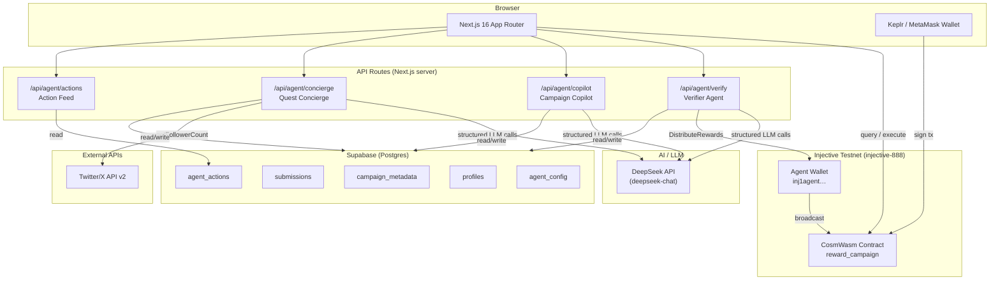

# Questa — AI-Powered Social Quest Platform on Injective

**Questa** is a full-stack Web3 social campaign platform where brands create on-chain reward pools and participants earn INJ by completing social quests (post, follow, repost). Three autonomous AI agents handle submission verification, campaign strategy, and participant guidance — with every on-chain action logged, explainable, and reversible by the campaign creator.

---

## Architecture



---

## Agents

| Agent | Route | What it does |
|---|---|---|
| **Verifier** | `POST /api/agent/verify` | LLM-judges each submission, runs sybil heuristics (duplicate content hash, shared Twitter handle), updates `agent_verdict`, auto-distributes rewards if `auto_distribute=true` |
| **Copilot** | `POST /api/agent/copilot` | `mode=compose` — turns a free-text brief into a full campaign config; `mode=insights` — analyses participation velocity, sentiment, recommends actions |
| **Concierge** | `POST /api/agent/concierge` | Tool-using read-only agent on `/quests`: checks wallet eligibility, ranks quests by expected reward, explains failed criteria. Never signs. |

Every agent action is:
- **Idempotent** — `agent_actions` row inserted as `pending` before execution; confirmed/failed after
- **Explainable** — full reasoning text stored; SHA-256 of reasoning committed as tx memo
- **Overridable** — creator can manually approve/reject any AI verdict from the campaign admin page

---

## Contract

| | |
|---|---|
| **Chain** | Injective testnet (`injective-888`) |
| **Contract address** | `inj1ndqm2rhw55ruq49qzylvzwyvj2v9y6apc2gsd6` |
| **Code ID** | `39567` |
| **Agent wallet** | Set `AGENT_MNEMONIC` — run `npx tsx -e "const {PrivateKey}=require('@injectivelabs/sdk-ts'); console.log(PrivateKey.fromMnemonic(process.env.AGENT_MNEMONIC).toBech32())"` to get address |

### Contract messages

| Message | Description |
|---|---|
| `CreateCampaign` | Fund a campaign with INJ reward pool; optionally set `operator` (agent wallet) |
| `JoinAndSubmit` | Participant joins + submits post URL in one tx |
| `DistributeRewards` | Creator **or** the registered operator splits pool across participants |
| `ClaimReward` | Participant withdraws their INJ reward |
| `CancelCampaign` | Creator cancels and gets refunded |

> **Note:** The `operator` field on `CreateCampaign` enables the Verifier Agent to call `DistributeRewards` autonomously. Set it to your `AGENT_MNEMONIC` wallet address when creating campaigns.

---

## Environment Variables

Create `frontend/.env.local`:

```env
# ── Required ─────────────────────────────────────────────────────────────────

# DeepSeek API key — powers all three AI agents
DEEPSEEK_API_KEY=sk-...

# Supabase project
NEXT_PUBLIC_SUPABASE_URL=https://<project>.supabase.co
NEXT_PUBLIC_SUPABASE_ANON_KEY=sb_publishable_...

# CosmWasm contract on Injective testnet
NEXT_PUBLIC_CONTRACT_ADDRESS=inj1ndqm2rhw55ruq49qzylvzwyvj2v9y6apc2gsd6

# ── Agent wallet (server-side only — NEVER expose client-side) ────────────────

# 24-word BIP-39 mnemonic for the agent wallet
# The agent wallet must have ≥0.1 INJ on testnet to pay gas for auto-distribution
AGENT_MNEMONIC=word1 word2 ... word24

# Optional: protect the /api/agent/verify endpoint for cron use
AGENT_SECRET=your-secret-here

# Supabase service role key — required for idempotency writes from server routes
SUPABASE_SERVICE_ROLE_KEY=eyJ...

# ── Optional ──────────────────────────────────────────────────────────────────

NEXT_PUBLIC_APP_URL=http://localhost:3000
TWITTER_CLIENT_ID=...
TWITTER_CLIENT_SECRET=...
TWITTER_BEARER_TOKEN=...
NEXT_PUBLIC_WALLETCONNECT_PROJECT_ID=...
```

> **Security:** `AGENT_MNEMONIC`, `DEEPSEEK_API_KEY`, `TWITTER_BEARER_TOKEN`, and `SUPABASE_SERVICE_ROLE_KEY` are server-only. They must never be prefixed with `NEXT_PUBLIC_`.

---

## 5-Minute Local Setup

### Prerequisites

- Node.js ≥ 20, npm
- A Keplr or MetaMask wallet with testnet INJ ([faucet](https://testnet.faucet.injective.network/))
- A [Supabase](https://supabase.com) project (free tier works)
- A [DeepSeek API](https://platform.deepseek.com) key (free tier works)

### Steps

```bash
# 1. Clone and install
git clone https://github.com/0xZorak/questa
cd questa/frontend
npm install

# 2. Configure environment
cp .env.local.example .env.local   # or create from scratch
# → Fill in DEEPSEEK_API_KEY, NEXT_PUBLIC_SUPABASE_*, AGENT_MNEMONIC

# 3. Run Supabase migration (once)
# → Open https://supabase.com/dashboard → SQL Editor → paste contents of:
#    frontend/supabase/migrations/001_agent_tables.sql
# → Run it

# 4. Seed demo data
npm run seed:demo

# 5. Start the dev server
npm run dev
```

Open **http://localhost:3000** — the app is live.

> The contract is already deployed at `inj1ndqm2rhw55ruq49qzylvzwyvj2v9y6apc2gsd6`. You do **not** need to redeploy unless you change the contract source.

### Redeploy contract (optional)

If you modify `contracts/reward_campaign/src/`:

```bash
# Requires: Rust nightly + wasm32 target + wasm-opt
cd frontend
MNEMONIC="your 24 words here" npx tsx deploy.ts
# → .env.local is updated automatically with the new contract address
```

---

## 3-Minute Demo Flow

### Scene setup (before the demo)

```bash
# In one terminal
cd frontend && npm run dev

# In another terminal — seed fresh demo data
npm run seed:demo
```

---

### Step 1 — Connect wallet & find a quest (30 sec)

1. Open **http://localhost:3000/quests**
2. In the bottom-right corner, click the **✦ Concierge** button
3. Type: *"What quests can I join right now?"*
4. The Quest Concierge calls `listActiveCampaigns` and `getInjBalance` live, explains eligibility, and ranks by expected reward
5. Click the **"Questa Launch Buzz"** campaign card

---

### Step 2 — Submit a quest entry (30 sec)

1. On the campaign page, click **"Join & Submit"**
2. Sign the transaction in Keplr/MetaMask (Injective testnet)
3. Paste any tweet URL — e.g. `https://x.com/you/status/12345`
4. The submission is recorded on-chain and in Supabase

---

### Step 3 — Run the Verifier Agent live (60 sec)

1. Open **http://localhost:3000/campaigns/1** while connected as the campaign creator
2. Scroll to **"Participants"** — you'll see 5 unverified submissions (from `npm run seed:demo`)
3. Click **"Run Verifier Agent"**
4. Watch the verdicts populate in real time:
   - **alice · bob · carol** → `approve` (green ✓, score 75–90)
   - **spammer99** → `reject` (low effort, missing hashtags)
   - **sybil** → `reject` (🚨 `duplicate_content` + `shared_twitter_handle` flags)
5. Because `auto_distribute=true` on Campaign 1, the agent **immediately broadcasts `DistributeRewards`** — a tx hash appears
6. Click the tx hash → opens Injective testnet explorer with the on-chain distribution proof

---

### Step 4 — Agent transparency (30 sec)

1. Open **http://localhost:3000/agents**
2. See the full action log: agent name, decision, confidence score, full LLM reasoning, tx hash
3. Expand the sybil row — read the exact reasoning the LLM wrote + the sybil flags that triggered rejection

---

### Step 5 — Bonus: Campaign Copilot (30 sec)

1. Open **http://localhost:3000/campaigns/create**
2. In the sidebar, type a brief: *"Run a viral campaign to grow Injective's Twitter following"*
3. The Copilot fills every form field automatically — title, hashtags, duration, reward pool, distribution mode

---

## Key Design Decisions

| Decision | Rationale |
|---|---|
| **Fail-closed verification** | Any LLM error → submission stays unverified. Errs on the side of not paying out. |
| **Idempotency-first** | `agent_actions` row inserted as `pending` before every on-chain action — prevents duplicate broadcasts even under retry/crash. |
| **TX_TIMEOUT ≠ retry** | If a tx times out, the agent polls `pollTxHash()` instead of re-broadcasting — avoids double-spend. |
| **Server-only secrets** | `AGENT_MNEMONIC`, `DEEPSEEK_API_KEY`, `TWITTER_BEARER_TOKEN` never reach the browser; Next.js server components / route handlers only. |
| **Reasoning on-chain** | SHA-256 of the agent's full reasoning is committed as the tx memo (`questa-agent:<hash16>`). The reasoning is stored in `agent_actions`. Anyone can verify the hash matches. |
| **DeepSeek via OpenAI SDK** | Drop-in replacement — swap `baseURL` and `apiKey` to switch to GPT-4 or Claude without changing call sites. |

---

## Project Structure

```
questa/
├── contracts/reward_campaign/     # CosmWasm smart contract (Rust)
│   └── src/
│       ├── contract.rs            # execute / query entry points
│       ├── msg.rs                 # CreateCampaign, DistributeRewards, …
│       ├── state.rs               # Campaign struct (with operator field)
│       └── error.rs
├── frontend/
│   ├── scripts/
│   │   └── seed-demo.ts           # Demo seed script
│   ├── supabase/migrations/
│   │   └── 001_agent_tables.sql   # agent_actions, agent_config tables
│   ├── src/
│   │   ├── app/
│   │   │   ├── page.tsx           # Dashboard (live campaigns)
│   │   │   ├── quests/            # Quest browser + Concierge FAB
│   │   │   ├── campaigns/
│   │   │   │   ├── create/        # Create campaign + Copilot sidebar
│   │   │   │   └── [id]/          # Campaign admin + Verifier + Insights
│   │   │   ├── agents/            # Agent transparency page
│   │   │   └── api/agent/
│   │   │       ├── verify/        # Verifier Agent
│   │   │       ├── copilot/       # Campaign Copilot
│   │   │       ├── concierge/     # Quest Concierge
│   │   │       └── actions/       # Action feed
│   │   ├── lib/
│   │   │   ├── errors.ts          # AppError taxonomy
│   │   │   ├── retry.ts           # Exponential backoff with jitter
│   │   │   ├── logger.ts          # Structured JSON route logger
│   │   │   ├── idempotency.ts     # Supabase-backed action idempotency
│   │   │   ├── injective.ts       # Chain helpers + pollTxHash
│   │   │   └── agent/
│   │   │       ├── wallet.ts      # Agent wallet (server-only)
│   │   │       └── llm.ts         # Zod-validated DeepSeek calls
│   │   └── components/
│   │       ├── Toast.tsx          # Toast + useToastError hook
│   │       └── ErrorBoundary.tsx  # React error boundary
│   └── deploy.ts                  # Contract build + deploy script
└── README.md
```

---

## Links

- **Injective testnet explorer:** https://testnet.explorer.injective.network/
- **Testnet faucet:** https://testnet.faucet.injective.network/
- **DeepSeek API:** https://platform.deepseek.com/
- **Supabase:** https://supabase.com/
